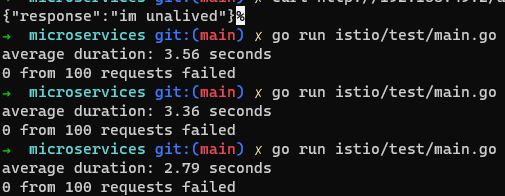
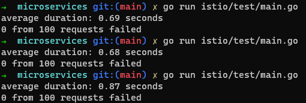
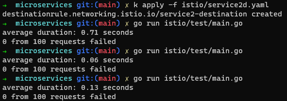

# Micorservices labs (Команда 9)
- ***Вавринюк Максим*** - movie-service
- ***Тітов Єгор*** - admin-service
- ***Юдаков Олександр*** - user-service

***Тема:*** Система рекомендацій фільмів.
- Сервіс пошуку даних про фільми (movie-service): Цей сервіс відповідатиме за отримання даних про фільми з різних джерел, наприклад IMDB.
- Сервіс рекомендацій (user-service): Цей сервіс відповідатиме за аналіз історії переглядів та вподобань користувача і генерувати рекомендації фільмів на основі його інтересів.
    - Цей сервіс має postgres базу даних та міграції з [golang-migrate](https://github.com/golang-migrate/migrate), що запускаються [отут](https://github.com/Jedich/microservices-labs/blob/main/user_service/db/db.go#L51).
- Сервіс адміністрування (admin-service): Цей сервіс відповідатиме за адміністрування юзерів та перегляд статистики.
- Клієнт.

## Результати ЛР-4:

- Тестування без Istio

- retry/timeout

- circuit breaker

