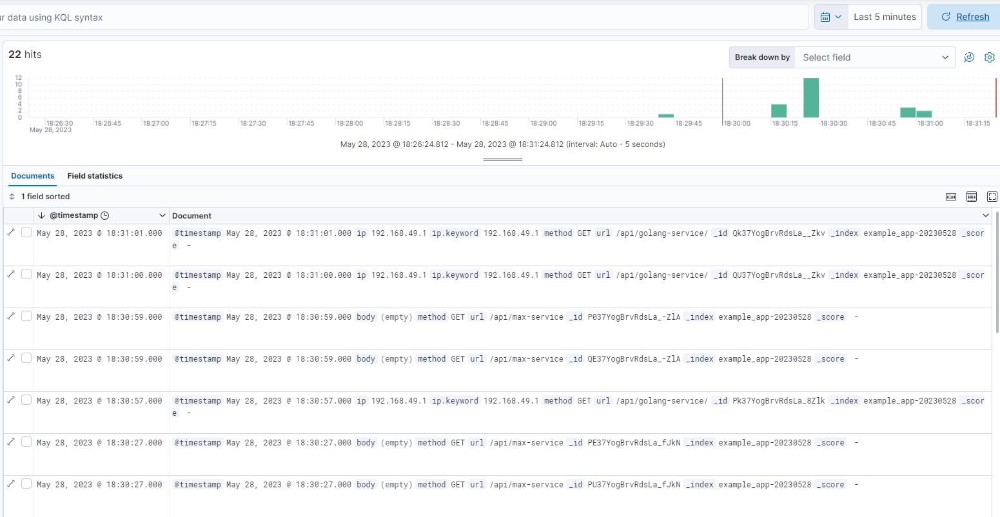
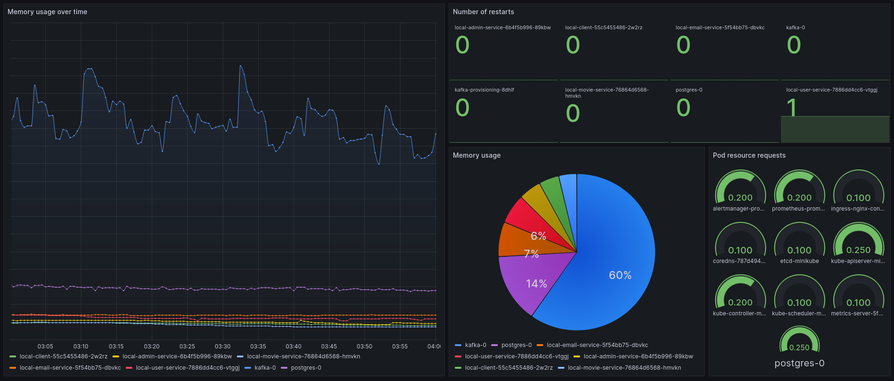

# Micorservices labs (Команда 9, ІА-02)
- ***Вавринюк Максим*** - movie-service
- ***Тітов Єгор*** - admin-service, auth-service
- ***Юдаков Олександр*** - user-service, email-service

***Тема:*** Система рекомендацій фільмів.
- Сервіс пошуку даних про фільми (movie-service): Цей сервіс відповідатиме за отримання даних про фільми з різних джерел, наприклад IMDB.
- Сервіс рекомендацій (user-service): Цей сервіс відповідатиме за аналіз історії переглядів та вподобань користувача і генерувати рекомендації фільмів на основі його інтересів.
    - Цей сервіс має postgres базу даних та міграції з [golang-migrate](https://github.com/golang-migrate/migrate), що запускаються [отут](https://github.com/Jedich/microservices-labs/blob/main/user_service/db/db.go#L51).
- Сервіс адміністрування (admin-service): Цей сервіс відповідатиме за адміністрування юзерів та перегляд статистики.
- Сервіс авторизації/аутентифікації (auth-service).
- Сервіс для надсилання email-сповіщень (email-service).
- Клієнт.

***Асинхронна комунікація (ЛР-5):***
- Топік ***email-notification***: _user_service_[(producer)](https://github.com/Jedich/microservices-labs/blob/main/user_service/controllers/email_controller.go) -> _email_service_[(consumer)](https://github.com/Jedich/microservices-labs/blob/main/email_service/main.go). Для надсилання email-листів.

- Топік ***auth-events***: _auth_service_[(producer)](https://github.com/Jedich/microservices-labs/blob/main/auth_service/index.js) -> _movie_service_[(consumer)](https://github.com/Jedich/microservices-labs/blob/main/movie_service/consumer.js). Для реєстрації івенту реєстрації в одному або декількох сервісах.

## ЛР-6:
Для імплементації централізованого логування було локально піднято EFK стек (Elasticsearch, Fluent, Kibana) ([docker-compose.yaml](https://github.com/Jedich/microservices-labs/tree/main/tools/efk/docker-compose.yml)), та оновлено сервіси. Також за прикладом було піднято Prometheus та Grafana.

- Kibana

- Дашборд Gradana

## ЛР-4:

- Тестування без Istio

- retry/timeout

- circuit breaker

